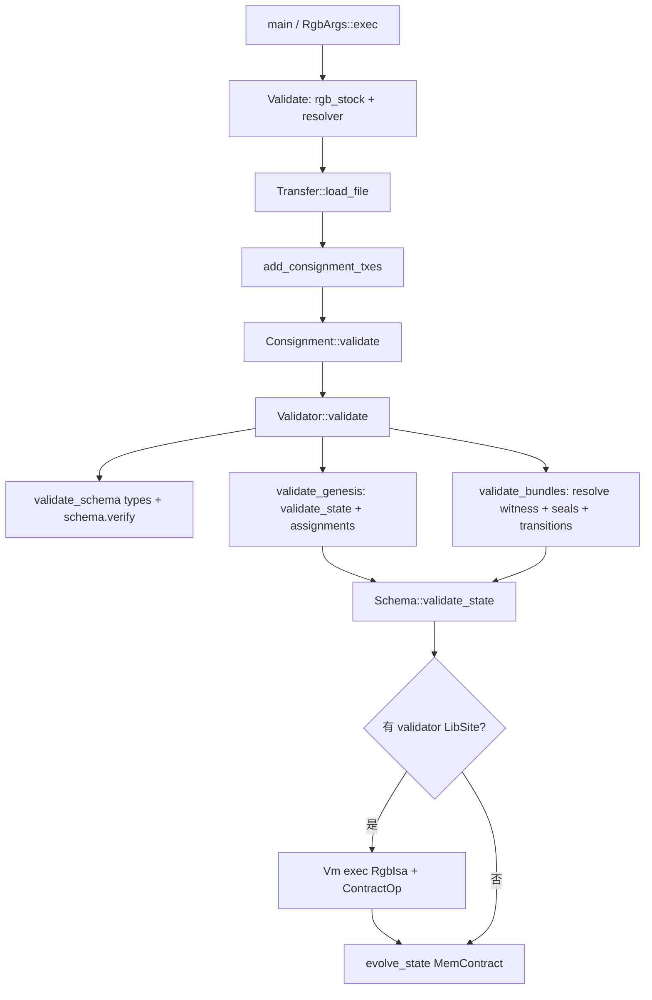

# `validate` 命令执行流程与 ALUVM 设计说明

本文根据本仓库 **rgb-api** 源码，以及依赖中的 **rgb-ops**、**rgb-consensus**（crate 名 `rgbcore`）、**rgb-aluvm**（Rust 中以 `aluvm` 库名引用）梳理 `validate` 全流程；ALUVM 相关部分较详。依赖版本以当前 `Cargo.lock` 为准。

---

## 1. 本仓库内：`validate` 从 CLI 到库调用

**入口**

- `rgb` 二进制：`cli/src/main.rs` 里 `run()` → `RgbArgs::parse()` / `args.exec(conf, "rgb")`。
- 子命令在 `cli/src/command.rs` 的 `Command::Validate { file }`。

**`Validate` 分支实际做的事**（逻辑很短）：

```rust
// cli/src/command.rs — Command::Validate（约 1023–1040 行）
            Command::Validate { file } => {
                let stock = self.rgb_stock()?;
                let mut resolver = self.resolver()?;
                let consignment = Transfer::load_file(file)?;
                resolver.add_consignment_txes(&consignment);
                let validation_config = ValidationConfig {
                    chain_net: self.chain_net(),
                    trusted_typesystem: stock.as_stash_provider().type_system()?.clone(),
                    ..Default::default()
                };
                let validated_consignment = consignment.validate(&resolver, &validation_config)?;
                let status = validated_consignment.validation_status();
                if status.validity() == Validity::Valid {
                    eprintln!("The provided consignment is valid")
                } else {
                    eprintln!("{status}");
                }
            }
```

逐步含义：

1. **`rgb_stock()`**（`cli/src/args.rs`）：从配置目录加载本地 **Stock**（stash/state/index），主要这里要用的是 **`trusted_typesystem`**：与 consignment 里带的 strict 类型系统逐项比对，防止类型定义被篡改。
2. **`resolver()`**：按 `--esplora` / `--electrum` / `--mempool` 之一构造 **`AnyResolver`**，并 `check_chain_net` 与当前 CLI 网络一致。
3. **`Transfer::load_file`**：从文件反序列化 **transfer consignment**（`rgb-ops` 里 `Transfer = Consignment<true>`）。
4. **`add_consignment_txes(&consignment)`**：把 consignment 各 bundle 里附带的 **公开 witness 交易**塞进 resolver 的本地 map；解析时若命中，直接返回 `WitnessStatus::Resolved(..., WitnessOrd::Tentative)`，**不经过索引器**。这样未上链/仅包内带的 tx 也能做见证解析（有安全风险，注释里写了 “Use with caution”）。
5. **`ValidationConfig`**：`chain_net`、`trusted_typesystem` 来自上面；其余用默认（例如 `safe_height` 默认不限制，`build_opouts_dag` 默认 false）。
6. **`consignment.validate(&resolver, &config)`**：核心校验（见下一节）。
7. 根据返回的 **`validation_status().validity()`** 打日志；**注意**：即使有一些 **Warning**，`Validity::Valid` 仍可能为真，所以会打印 “valid”；非 Valid 则打印完整 status。

---

## 2. `Consignment::validate`（rgb-ops）：前置检查 + 调用 `Validator`

在 **`rgb-ops`** 的 `containers/consignment.rs` 中，`validate` 先做 **类型/结构** 上的快速检查，再调用共识层：

- `transfer` 标记必须与 `Transfer`/`Contract` 泛型一致。
- 合约型 consignment 不得含 bundles/terminals。
- `terminals` 里列出的每个 `bundle_id` 必须在 consignment 的 bundles 里存在。

然后通过：

`Validator::<MemContract<MemContractState>, _, _>::validate(&self, resolver, (&schema, contract_id), validation_config)`

- 状态载体是 **`MemContract<MemContractState>`**：在内存里重放合约状态，供脚本读全局状态等。
- `context` 是 **`(&Schema, ContractId)`**，与 `MemContract` 的 `ContractStateEvolve::Context` 一致。

成功则包装成 **`ValidConsignment`**，带上 **`validation::Status`**（失败/警告/信息都累积在这里）。

---

## 3. `Validator::validate`（rgb-consensus）：三大阶段

在 **`rgb-consensus`** 的 `validation/validator.rs` 里，静态方法 `validate` 顺序是：

1. **`init`**：从 consignment 取 genesis → `contract_id`、`schema_id`、`chain_net`；把 consignment 里的 **脚本库** `scripts` 建成 `LibId -> Lib` 的 map；初始化 `MemContract`；包装 resolver（校验返回的 txid 与请求的 witness_id 一致）。
2. **链网**：consignment 的 `chain_net` 必须等于 `ValidationConfig.chain_net`；再 `resolver.check_chain_net`。
3. **`validate_schema`**
   - 对 consignment 的每个类型：`trusted_typesystem` 必须与 consignment 内嵌类型一致（否则 `TypeSystemMismatch`）。
   - `schema.verify(types)`：schema 自洽（含对脚本引用等的检查，具体在 schema 模块）。
4. **`validate_genesis`**
   - schema id 与 genesis 一致。
   - 调用下面要说的 **`Schema::validate_state`**（genesis，无 prev state）。
   - **`process_assignments`**：把 genesis 输出的每个 assignment 登记到 `opout_assigns`（供后续 transition 消费）。
5. **`validate_bundles`**（对每个 witness bundle）
   - **`resolve_witness`**：必须从 resolver 得到 **已解析且非 Archived** 的 witness（否则 `SealNoPubWitness`）。
   - 对每个 `known_transition`：**`validate_transition`**，其中依次包括：
     - opid、contract_id、与 bundle 的 **input_map** 一致性；
     - 从 `opout_assigns` 取出输入对应的 seal+state，收集要关闭的 seals，并检测 **DAG 无环**（重复消费 `CyclicGraph`）；
     - **`validate_seal_closing`**：DBC/MPC 承诺与比特币交易上的 op_return / taproot 输出一致，并 **verify_many_seals**；
     - 再次 **`Schema::validate_state`**（带 `prev_state`）。
   - 每个 transition 成功后 **`process_assignments`** 登记新输出。
   - 若配置了 `safe_height`，可能往 status 里加 **`Warning::UnsafeHistory`**。

**ALUVM 只出现在 `Schema::validate_state` 的“业务状态校验”末尾**，不是在 schema 解析或 seal 验证里单独跑一台 VM。

---

## 4. ALUVM 相关设计（重点）

### 4.1 `rgb-aluvm` 与 `aluvm` 这个名字

- Crate 名是 **`rgb-aluvm`**，但在其 **`Cargo.toml` 里 `[lib] name = "aluvm"`**，所以 **`rgb-consensus` 里 `use aluvm::...` 实际链接的是 RGB 维护的 AluVM 实现**（带 `rgb-ascii-armor` 等 feature），不是另一套无关 crate。

### 4.2 通用 AluVM 执行模型（`rgb-aluvm` / `vm.rs`）

- **`Vm<Isa>`**：一块 **`CoreRegs`**（含 **st0** 成功/失败、计数器、调用栈等）。
- **`exec(entry: LibSite, lib_resolver, context)`**：从 **`LibSite`（库 id + 入口字节偏移）** 开始执行；通过闭包 **`|LibId| -> Option<&Lib>`** 取库；库的 **`exec`** 驱动指令解码与寄存器更新；循环直到无后续调用点；**返回值是最终 `registers.st0`（bool）**。

设计要点（与官方 AluVM 文档一致）：无随机内存访问、有界步数、非法/未定义运算把目标寄存器置 undefined，扩展 ISA 通过 **指令集 trait** 注入。

### 4.3 RGB 专用 ISA：`RgbIsa` + `ContractOp`（`rgb-consensus` `vm/isa.rs`, `vm/op_contract.rs`）

- **`RgbIsa<S: ContractStateAccess>`**
  - **`Contract(ContractOp<S>)`**：RGB 业务指令。
  - **`Fail(u8)`**：未知操作码 → 走控制流 Fail（并让 st0 为 false）。
- 实现 **`InstructionSet`**：声明 ISA 段名 **`"RGB"`**、源/目的寄存器、**复杂度**（用于计费/限步）、**`exec` → 委托给 `ContractOp`**。
- 实现 **`Bytecode`**：操作码落在 **`INSTR_RGBISA_FROM..=INSTR_RGBISA_TO`**；解码时若在 **`ContractOp` 范围内** 则解成 `ContractOp`，否则 **`RgbIsa::Fail`**。

**`ContractOp`** 是一组 **读当前 operation / 合约状态** 的指令，例如（摘自 `op_contract.rs` 注释与枚举名）：

- **计数**：`CnP` / `CnS` / `CnG` / `CnC` —— 对输入、输出、本 op 全局项、合约累积全局项计数，写入各类 **A 寄存器**。
- **装载状态**：`LdP`（prev structured）、`LdS`（owned structured）、`LdF`（fungible）、`LdG`（本 op 全局）、以及从合约状态深度装载全局等；失败时置 **st0 false** 并终止；concealed 状态可映为 **None**。
- 还有元数据、ECDSA 验证类（`Vts` 等）、以及其它与 RGB 状态机相关的操作（文件后半还有更多 opcode）。

这些指令的 **`exec`** 都拿到 **`VmContext`**，其中包含 **`OpInfo`**（当前 op、prev_state 等）和 **`Rc<RefCell<S>>` 的 `contract_state`**，因此脚本可以在 **确定性** 条件下读 **本次 transition 的输入/输出/全局** 以及 **已累计的合约全局状态**（通过 `ContractStateAccess`）。

### 4.4 校验流程里 VM 何时、如何跑（`rgb-consensus` `validation/logic.rs`）

`Schema::validate_state` 的顺序很重要：

1. 按 **genesis / 某类 transition** 取 **metadata / globals / inputs / assignments** 的 schema。
2. **`validate_metadata` / `validate_global_state` / `validate_prev_state` / `validate_new_state`**：先用 **strict types** 和 schema 约束把 **结构与张成** 卡死（注释写明：**脚本不负责再验结构**）。
3. 构造 **`VmContext { contract_id, op_info, contract_state }`**。
4. **若 schema 为该 op 配置了 `validator`（内含 `LibSite` → 入口与库 id）**：
   - `Vm::<Instr<RgbIsa<S>>>::new()`
   - 对 **transition**：把 **transition 类型号** 写入 **`RegA::A16` / `Reg32::Reg0`**（genesis 不写）。
   - 从 consignment 的 **`scripts`** map 取出 **`validator.lib` 对应的 `Lib`**，并核对 **库 id 与脚本一致**（否则 `ScriptIDMismatch`；缺失则 `MissingScript`）。
   - **`vm.exec(validator, |id| scripts.get(&id), &context)`**
     - 若返回 **false**：从 **`RegA::A8` / `Reg32::Reg0`** 读可选 **错误码**，报 **`Failure::ScriptFailure`**。
   - 若 VM 成功：调用 **`contract_state.borrow_mut().evolve_state(op)`**（`OrdOpRef`），把该 op **提交到内存合约状态**；若失败则 **`ContractStateFilled`** 等。

因此：**ALUVM 执行的是 schema 指定的“业务不变式”**；**状态演进与 consignment 图一致**，且仅在脚本成功后才 `evolve_state`，保证 **链式校验时后续 op 看到的全局状态** 已包含前面已验证 op 的累积效果。

### 4.5 与 `MemContract` 的配合（rgb-ops `persistence/memory.rs`）

- **`MemContract::init((schema, contract_id))`** 建空状态。
- 每次 **`evolve_state`**：对 genesis / transition 调 **`MemContractWriter::add_genesis` / `add_transition`**，并更新 **witness 序** filter，使 **`ContractStateAccess`** 上读到的全局/权利等视图与验证顺序一致。

---

## 5. 端到端串起来（简图）



---

## 6. 小结

- **本仓库**里 `validate` 只是 **组配置、加载 consignment、增强 resolver、调用 `validate`、打印 `Status`**；**不重写共识**。
- **共识与 ALUVM** 在 **`rgb-consensus`（`rgbcore`）**：**先类型与 seal/锚定**，再在 **`Schema::validate_state` 末尾** 用 **`aluvm::Vm<Instr<RgbIsa<MemContract<...>>>>`** 跑 schema 绑定的 **脚本库**，用 **`RgbIsa`/`ContractOp`** 读 op 与合约状态，**st0** 表示成败；成功后 **内存状态演进** 供后续 op 使用。
- **`rgb-aluvm`** 是 **AluVM 的 RGB 线维护版本**，在依赖里以 **`aluvm`** 库名出现。

---

## 7. 扩展说明

若需把 **某一种 schema 的 validator 字节码** 或 **`ContractOp` 全集**按指令表逐项对照，可在本地 `rgb-consensus` 源码中对照 `vm/op_contract.rs` 做「指令 → 寄存器 → 状态语义」表；具体以当前 lockfile 中的 `rgb-consensus` 版本为准。
